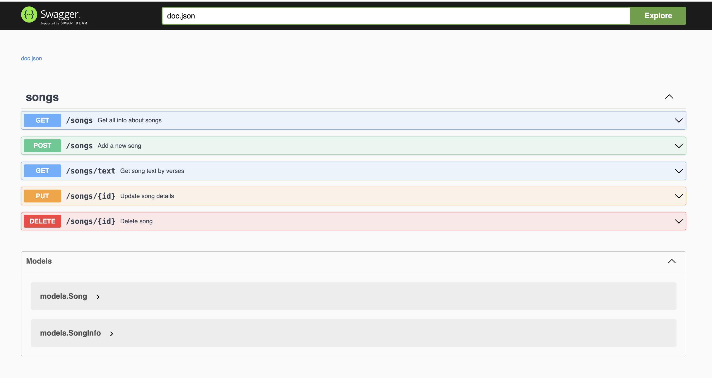

# music-lib

API для управления библиотекой с музыкой, который позволяет пользователям хранить, извлекать и изменять информацию о песнях. 

Поддерживается фильтрация по названию группы и песни. Предполагается, что (группа, название песни) создают уникальную пару в базе данных. Удаление и обновление происходит с запросом у пользователя id в базе, для большей безопасности. Добавление происходит с запросом во внешнюю API для извлечения дополнительной информации (есть небольшой тест, для проверки работы функционала в папке services). 

Стек технологий: Golang, PostgresSQL, Docker, Swagger (API Documentation), Chi (HTTP Router), Slog (Logging).

```
Перед запуском необходимо изменить некоторую информацию в Makefile.
```

Для запуска необходимо, чтобы все программы были установлены. Также измените данные в Makefile, согласно базе данных, которая будет поднята в контейнере. 

```
В Makefile используется функция gtimeout для mac. Замените на timeout при использование дистрибутивов Linux.
```

В Makefile команда create_env автоматически создаст .env file с необходимыми настройками. LOGGER_LEVEL может принимать значения debug и info.

Команды ```make all``` и ```make all_with_data``` будут отличаться тем, что добавляется некоторые тестовые данные в базу данных. Все миграции находятся в папке schema. 

Для запуска всего
```
make all
```
Для запуска отдельных компонентов обращаться к Makefile.

